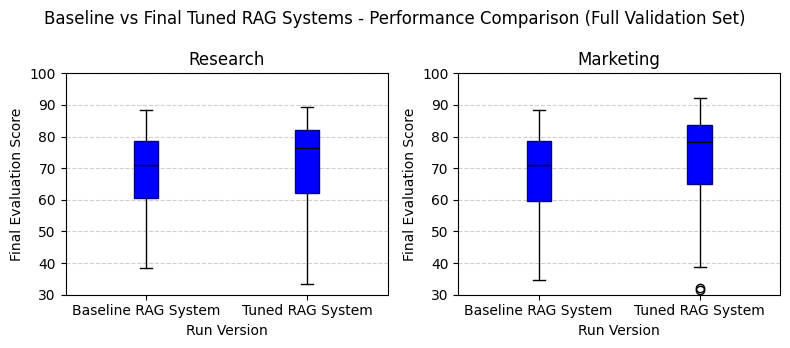

# Tailored Knowledge Retrieval Using RAG and LLMs
A comprehensive study on developing and evaluating a Retrieval-Augmented Generation (RAG) system for domain-specific Q&A.

**Note on Code Availability**: Due to academic policies and to safeguard the integrity of this project, the underlying code for this project cannot be publicly shared in this repository. This repository serves as a detailed documentation and demonstration of the project's methodology, results, and insights. A comprehensive [**paper**](Final_Chow_Kevin_RAG_Findings_Results_Report.pdf) detailing the project is available for review.

---

## 🚀 Project Overview

This **proof of concept (POC)** demonstrates the potential of a **Retrieval-Augmented Generation (RAG)** system, built with the **LangChain** software framework, to significantly increase productivity and achieve cost savings by optimizing internal question-answering and search capabilities. This tool aims to elevate employee understanding and empower action by providing intelligent, insightful answers to complex questions, specifically tailored for **corporate engineering research and marketing teams** regarding Machine Learning and GenAI concepts. While this initial iteration serves as a foundational building block rather than a perfectly-tuned final product, it showcases the immense opportunity to leverage LLMs and GenAI for business-specific knowledge retrieval.

---

## 📊 Data Used

The knowledge base for this project was constructed from a curated collection of **Machine Learning and GenAI documentation**.

* **Source:** A set of ML and GenAI related documents, compiled from various publicly available academic papers (**ArXiv**), online encyclopedias entries (**Wikipedia**), and industry **blogs**, was utilized as the knowledge base for the RAG system.
* **Size:** Consists of **48 total documents**, comprising **562 research paper pages** and **10,698 chunks of text** from online webpages.
* **Characteristics:** Consists of documents containing information related to **Machine Learning (ML)**, **Large Language Models (LLMs)**, and **Generative AI (GenAI)**.
* **Preprocessing:** The documents were split, transformed into embeddings using a semantic search-designed embedding model (**multi-qa-mpnet-base-cos-v1**), and then stored in a vector store.
  
---

## 🛠️ Methodology & Technical Approach

This methodology focused on demonstrating the potential that a RAG pipeline holds when applied to addressing specific knowledge retrieval needs for corporate engineering research and marketing teams. A linear, systematic approach was taken to highlight this potential.

### Core RAG Components & Choices

#### Data Preparation & Embeddings
Documents were loaded, split into chunks, and transformed into embeddings. **Cosine similarity** was chosen for measuring text similarity due to its efficiency and interpretability. The **`multi-qa-mpnet-base-cos-v1`** embedding model was utilized, specifically designed for semantic search.

#### Retrieval Optimization
We employed **Qdrant** as the vector store for efficient retrieval. Experiments focused on optimizing context retrieval, including testing various **retriever types** (e.g., similarity search, Maximal Marginal Relevance), and integrating a **cross-encoder re-ranker** (`ms-marco-MiniLM-L-6-v2`) to refine the relevance of retrieved chunks.

#### Generation with LLMs
**Mistral-7B** was selected as the Large Language Model for answer generation due to its balance of performance and cost efficiency. Extensive **prompt engineering** was conducted to guide the LLM, incorporate retrieved context, and minimize hallucinations. 

### Audience Tailoring
To meet the distinct needs of different user groups, **two separate RAG pipelines** were developed. This allowed for targeted optimization and analysis of answer quality for specific audiences, primarily balancing the depth required by engineering with the clarity needed for marketing.

### Evaluation Framework
The system's performance was assessed using a **weighted average score** (0-100) derived from four key metrics. LLM-based metrics (including Ragas) were initially explored but discarded due to non-deterministic behavior.

1.  **Context Quality (Precision at K - P@K):** (Weight: 0.2) Measures the semantic relevance of retrieved contexts.
2.  **Readability (Flesch Reading Ease Test):** (Weight: 0.05) Assesses the ease of understanding of the generated answers.
3.  **Surface Level Similarity (METEOR Score):** (Weight: 0.05) An n-gram based metric balancing precision and recall, comparing generated answers to gold answers.
4.  **Semantic Similarity, Cosine (Gold vs. Generated Answer):** (Weight: 0.70) Quantifies the overall semantic match between generated answers and expert-provided gold answers using embeddings without penalizing for length differences.

### Systematic Experimentation
A series of experiments were conducted on a subset of questions to systematically test and optimize various RAG parameters. This included exploring different embedding models, chunk sizes, overlaps, text splitters, number of contexts retrieved, retriever search types, re-ranker configurations, prompt structures, and LLMs, with optimal configurations selected at each stage based on both manual evaluation and an anaylsis of the evaluation metrics stated above.

**Note:** While this methodology provides a structured approach, it doesn’t fully acknowledge the interdependent nature of RAG parameters and components.

---

## ⚙️ Tools & Technologies Used

* **Language:** Python
* **Core Frameworks & Libraries:**
    * **LangChain:** The primary framework for building RAG pipelines, facilitating orchestration of components.
    * **Hugging Face Ecosystem:** Utilized `transformers` (for LLMs like Mistral-7B), `sentence-transformers` (for embedding models), `accelerate`, and `bitsandbytes` (for model optimization and efficient inference).
    * **Data Handling & Analysis:** `NumPy`, `Pandas`, `scikit-learn`, `pyarrow`.
    * **Text Processing & Evaluation:** `nltk` (for tokenization and METEOR), `textstat` (for Flesch Reading Ease).
    * **Web Parsing:** `BeautifulSoup4` (`bs4`).
* **Vector Stores:**
    * **Qdrant:** Employed as the primary vector store.
* **Large Language Models (LLMs):**
    * **Mistral-7B:** The primary LLM chosen for answer generation.
    * **Cohere:** Explored for its capabilities and for comparison with Mistral.
* **Document Loaders:** Specialized loaders were used for ingesting various document types, including `ArXivLoader`, `WikipediaLoader`, `PyMuPDFLoader` (for PDFs), and `WebBaseLoader` (for online content).
* **Text Splitters:** Tested `RecursiveCharacterTextSplitter`, `CharacterTextSplitter`, and `NLTKTextSplitter` for optimal text segmentation.

---

## ✨ Key Findings & Results

The systematic approach and experimentation yielded several key insights into optimizing RAG system performance and its practical applications, particularly in answer accuracy and the reduction of AI hallucinations.

* **Improved Answer Accuracy:** Through linear experimentation, an improvement of 7.2% and 10.43% (for engineering researcher and marketing audiences, respectively) in median score was demonstrated.
* **Reduced Hallucinations:** Prompt engineering combined with filtered, re-ranked context drastically minimized instances of the LLM generating factually incorrect or unsupported information.
* **Document Quality is Paramount:** The quality and ongoing curation of source documents are essential for maintaining system reliability and factual accuracy, in particular given the recent rate of advancement of this field.
* **Advanced Tuning Required:** Model tuning is ready to move beyond linear experimentation. Future testing should delve into more detailed fine-tuning, considering the interdependent nature of RAG parameters.
* **Evaluation Metrics Refinement:** While effective, the current evaluation metrics are not definitive. Further re-examination may provide a clearer picture of model performance and better guide future improvements.

### Visualization & Example Answer
Here are some visualizations highlighting the results:

### Example Question & Answers

**Question:** "What defines a large language model in the context of natural language processing tasks?"

**Engineering Research Answer:**
A large language model (LLM) refers to a machine learning model specifically designed for natural language processing tasks, particularly language generation. These models possess a substantial number of parameters, which enables them to capture intricate patterns and nuances within language data. They are typically trained using self-supervised learning methods on extensive amounts of textual data. This scale allows them to generate more accurate and contextually relevant responses during various NLP applications. However, it's important to note that there isn't a universally agreed-upon definition regarding the exact size or parameter count required to classify a model as "large." Instead, this term generally signifies advanced capabilities and increased computational demands compared to smaller language models.

**Marketing Answer:**
In the context of natural language processing tasks, a large language model (LLM) refers to a machine learning model specifically designed for language processing tasks like language generation. It has a substantial number of parameters and undergoes learning using an extensive dataset. The size of these models requires significant computational resources for their development and training.

### Final Model Specifications

* **Embedding Model:** `multi-qa-mpnet-base-cos-v1`
* **Chunk Size:** 256
* **Overlap:** 0
* **Search Type:** Similarity (Cosine)
* **Contexts Retrieved and Passed to Re-ranker:** 6
* **Re-ranker:** Cross-embedding Re-ranker
* **Re-ranker Contexts Passed to Prompt:** 5
* **Prompt Parts:** Role, Audience, Request, Context, Question
* **LLM:** Mistral 7-B

---

## 🚧 Challenges & Roadblocks

Developing this RAG system presented several interesting challenges:

* **Contextual Granularity:** Determining the optimal `chunk_size` was a balance between providing enough context and avoiding irrelevant information. Too small, and context was lost; too large, and noise was introduced. This required iterative testing and evaluation.
* **Hallucination Persistence:** While reduced, completely eliminating hallucinations required nuanced prompt engineering and careful filtering of retrieved documents.
* **Evaluation Complexity:** Designing comprehensive evaluation metrics beyond simple answer accuracy (e.g., P@K, semantic similarity to ground truth) was crucial but required careful consideration to ensure meaningful insights.

---

## 🌱 Lessons Learned

* **Iterative Optimization:** RAG systems are highly sensitive to component choices. Continuous iteration and a robust evaluation framework are critical for performance gains.
* **Prompt Engineering Power:** Small changes in prompts can significantly alter LLM behavior, especially in grounding responses in provided context.
* **Beyond Simple Retrieval:** Basic semantic search often isn't enough; techniques like re-ranking and MMR are essential for complex queries.

---

## 🔮 Future Work & Improvements

* **Further RAG Optimization:**  Continuous iteration and experimentation with both the RAG system and the evaluation framework for further optimization.
* **Hybrid Retrieval:** Explore combining semantic search with keyword-based retrieval for enhanced performance on diverse query types.
* **Fine-tuning Embeddings/LLM:** Experiment with fine-tuning smaller embedding models or LLMs on domain-specific data for even greater accuracy.
* **User Feedback Loop:** Implement a mechanism for user feedback to continually improve the RAG system's relevance and accuracy over time.
* **Deployment:** Develop a lightweight web interface (e.g., using Streamlit or FastAPI) to demonstrate the live Q&A capabilities.

---

## 📄 Full Technical Paper

For a more in-depth discussion of the project, including detailed methodology, experimental setup, and results, please refer to the [**Full Project Paper (PDF)**](Final_Chow_Kevin_RAG_Findings_Results_Report.pdf) located in this repository.

---

## 📧 Contact

Kevin Chow

Email: kchow2020@berkeley.edu

[LinkedIn Profile](https://www.linkedin.com/in/k-chow/)

---
